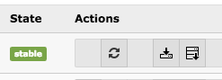



.. ==================================================
.. FOR YOUR INFORMATION
.. --------------------------------------------------
.. -*- coding: utf-8 -*- with BOM.

.. ==================================================
.. DEFINE SOME TEXTROLES
.. --------------------------------------------------
.. role::   underline
.. role::   typoscript(code)
.. role::   ts(typoscript)
   :class:  typoscript
.. role::   php(code)

Breaking changes
----------------

Version 4.0.0
~~~~~~~~~~~~~

The removal of the local category system requires the execution of a migration script, so existing
categories will get migrated to sys_category entries. Please use the update script in the extension
manager to process the migration as shown below.

Please click on the update-icon to start the category migration.

Version 3.0.0
~~~~~~~~~~~~~

The extension now has the default setting ``falMedia = 1`` in the extension settings. Make sure,
that you manually migrate images and flash files for image- and flash-banners manually.

If you still want to use non-FAL files for banners, you can switch off the falMedia setting in
the extension settings. Note, that this option will be removed in the next major version of the
extension!

Version 1.0.0
~~~~~~~~~~~~~

The inclusion of JavaScript libraries has moved to the page footer by using ``page.includeJSFooter``.
Due to this change, you may have to update your JavaScript includes in TypoScript. This only applies,
if you have overwritten the original ``page.includeJS`` inclusions.
